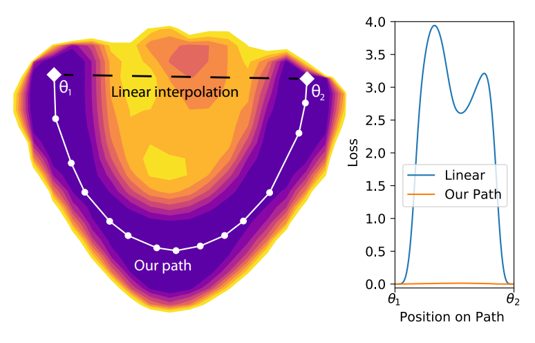
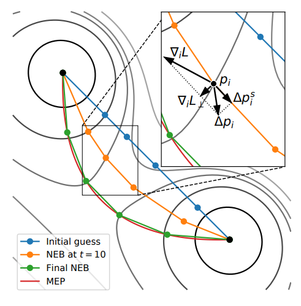
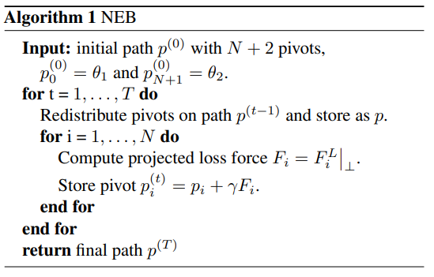
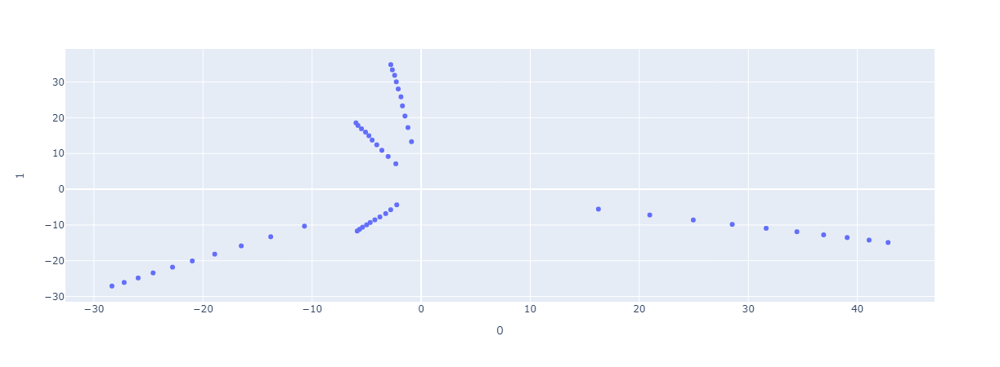
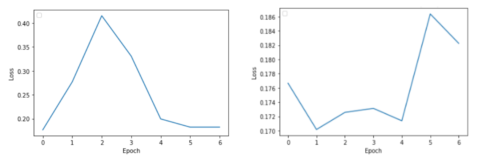

# Yapay Sinir Ağı Kararlarının Birleştirilmesi

## İçindekiler

- [Yapay Sinir Ağı Kararlarının Birleştirilmesi](#yapay-sinir-ağı-kararlarının-birleştirilmesi)
  - [İçindekiler](#i̇çindekiler)
  - [Özet](#özet)
  - [Giriş](#giriş)
  - [Yöntem](#yöntem)
  - [Bulgular](#bulgular)
  - [Sonuç](#sonuç)
  - [Referanslar](#referanslar)

## Özet

Bu proje kapsamında, farklı başlangıç noktaları ile eğitilmiş modellerin ulaştıkları son noktalar arasında, test başarısını düşürmeden yeni yollar arama üzerine çalışılmıştır. Bulunan yolların görselleştirilmesi ve bu yollar üzerindeki noktalar ile oluşturulan ensemble modeli ile son noktalar ile oluşturulan ensemble modelinin karşılaştırılması hedeflenmiştir. Yeni yollar arama aşamasında yolun kayıp değerine bakarak sürekli olarak yeni yol inşa edilmiştir. Bir adet metin ve bir adet görüntü kümesi üzerinde yapılan çalışmalarda gerçek anlamda minimum noktaların başarısına yakın farklı noktalar bulunmuştur. Bu modelin farklı son noktalar arasında test başarısını düşürmeden farklı yollar olabileceği anlamına gelmektedir.

## Giriş

Yapay Sinir Ağlarının hesaplama ve bilgi işlem gücünü, paralel dağıtılmış yapısından, öğrenebilme ve genelleme yeteneğinden aldığını söylenebilir. Genelleme, eğitim ya da öğrenme sürecinde karşılaşılmayan girişler için de YSA’nın uygun tepkileri üretmesi olarak tanımlanır. Bu üstün özellikleri, YSA’nın karmaşık problemleri çözebilme yeteneğini gösterir.YSA’nın temel işlem elemanı olan hücre, doğrusal değildir. Dolayısıyla hücrelerin birleşmesinden meydana gelen YSA da doğrusal değildir ve bu özellik bütün ağa yayılmış durumdadır. Bu özelliği ile YSA doğrusal olmayan karmaşık problemlerin çözümünde en önemli araç olmuştur. YSA’nın arzu edilen davranışı gösterebilmesi için amaca uygun olarak ayarlanması gerekir. Bu, hücreler arasında doğru bağlantıların yapılması ve bağlantıların uygun ağırlıklara sahip olması gerektiğini ifade eder. YSA’nın karmaşık yapısı nedeniyle bağlantılar ve ağırlıklar önceden ayarlı olarak verilemez ya da tasarlanamaz. Bu nedenle YSA istenen davranışı gösterecek şekilde ilgilendiği problemden aldığı eğitim örneklerini kullanarak problemi öğrenir. Eğitim örnekleriyle eğitilen YSA’nın probleme bağlı olarak çok boyutlu bir uzaydan oluştuğunu söylemek mümkündür. Bu uzay içerisinde de birden fazla yerel minimum noktanın olduğunu söylemek yanlış olmaz. Modelin başlangıç noktasına bağlı olarak farklı farklı yerel minimumlara gitmesi muhtemeldir. Çalışma içerisinde de gözlemlendiği üzere çok boyutlu bir modelde farklı başlangıç noktaları farklı yerel minimumlara ulaşmıştır. Yakın başlangıç noktaları ile eğitilen modellerin aynı yerel minimuma yönelmesi mümkündür. Ama bu çok nadir bir durum olarak gözlemlenmiştir.

Yerel minimum olarak ifade edilen noktalar genel olarak çukur bir yapı olarak tasvir edilse de modelin ulaştığı son noktaları ifade eden yerel minimum noktaları arasında, yerel minimum noktaları kadar başarı gösterebilecek, test başarısını koruyabilecek farklı noktalar bulmak ve bir yol oluşturmak mümkündür. Daha önce farklı yerel minimum noktalar arasında test başarısı düşürmeden yol bulma çalışmaları yapılmıştır. Bunlardan biri olan Essential No Barriers in Neural Network Energy Landspace yönteminde de bu konu üzerine yönelinmiş ve başarılı sonuçlar elde edilmiştir.Bu çalışmada da bir adet metin verisi ve bir adet görüntü verisi ile çalışılarak YSA’lar eğitilmiş ve elde edilen kararların test başarısı düşürülmeden birleştirilmesi hedeflenmiştir. Daha sonra birleştirilen yollar üzerindeki noktalar ile bir ensemble gerçekleştirerek başarı sonuçlarının son noktalar ile oluşturulan ensemble ile karşılaştırılması amaçlanmıştır.

## Yöntem

Yapay Sinir Ağlarının test hatası mimariye, eğitim setine ve ağın parametrelerine bağlıdır. Bu çalışma kapsamında aynı mimariye sahip ve aynı eğitim verisi ile eğitilmiş YSA ile çalışılarak sadece ağın parametreleri üzerinde değişikliklere odaklanılmıştır.Temel olarak her işlem adımında, farklı başlangıç noktaları ile eğitilen YSA modellerinin farklı son noktalara erişmiştir. Erişilen bu son noktalar ikili olarak ele alınmış ve her iki son nokta arasında bir doğru çizilmiştir. Çizilen doğrunun üzerinde bulunan noktaların parametreleri üzerinde çalışılarak en optimum yolun bulunması hedeflenmiştir.

İlk olarak tespit edilmiş olunan iki adet son nokta arasında (𝜃1, 𝜃2) çizilen doğru eşit parçaya bölünerek N adet nokta belirlenmiştir. Yapılan bu çalışmada N değeri 5 olarak atanmıştır. Ara noktaların belirlenmesinden sonra optimizasyon kısmının yapıldığı işlem adımlarına geçilmiştir. Bu aşamada benzer çalışmalarda sıklıkla kullanılmış ve başarısı kanıtlanmış olan Nudged Elastic Band (NEB) algoritması kullanılmıştır.NEB algoritması, bilinen noktalar arasındaki eyer noktalarını ve minimum enerji yollarını bulmak için geliştirilmiş bir algoritmadır (Jonsson ve diğerleri, 1998). Daha sonra bu metot geliştirilerek daha kısa bir versiyonu yayınlanmıştır (Henkelman & Jonsson, 2000). Bu algoritma özelinde de optimizasyon yöntemlerinde sıklıkla kullanılan Gradient Descent yönteminden faydalanılmaktadır. Ama problem içerisinde birden fazla nokta ile çalışılarak bir yol elde edilmesi temel hedef olduğu için Gradient Descent yönteminin kullanımına ek farklı parametrelerde için içine girmektedir. İlk olarak ele alınan noktanın türevi alınır. Daha sonra ele alınan nokta üzerinde bir koşula bağlı olarak tan (𝜏𝑖) değeri 
belirlenir. Tan değerinin belirlenmesi aşamasında ilgili noktanın bir sonraki ve bir önceki noktalarının kayıp değerleri karşılaştırılır. Esasen bu kayıp değerine bağlı olarak yönelim yönü belirlenmiş olur. 

NEB içerisinde geçen elastik kavramı da buradan gelmektedir. Elde edilen Gradient Descent değeri ve tan değerleri NEB algoritmasından gelen bir formüle tabi tutularak bir değişim miktarı ve değişim miktarının işaretine bağlı olarak bir yön belirleme işlemi tamamlanır. Bu adımlar uygulanarak en başta doğrusal formda olan yolun, kaybın az olduğu yöne evrilerek yay şeklini alacağını söylemek yanlış olmayacaktır. Elde edilen değişim miktarı bir öğrenme katsayısı ile çarpılarak ilgili noktaya eklenir. Netice olarak o noktanın bir sonraki seviyedeki yeri belirlenmiş olur.

## Bulgular

Bu çalışmada metin verisi olarak twitter yorumlarını içeren bir veri seti ve görüntü verisi olarakta Fashion MNIST veri seti ile çalışılmıştır. Her bir veri seti için ayrı model yapısı oluşturulmuştur. Oluşturulan model yapıları için 5 adet farklı başlangıç noktası atanmış ve modeller bu başlangıç noktaları ile eğitilmiştir. Eğitilen modellerin farklı son noktalara ulaştığı PCA ile 2 boyutlu ve 3 boyutlu olarak görselleştirilmiştir.

Son noktaların elde edilmesinden sonra, noktalar ikili olarak ele alınarak her iki son nokta arasında 5 noktadan oluşan bir doğru oluşturulmuştur. Daha sonra bu noktalar üzerinde NEB algoritması uygulanmıştır. Bu noktada iterasyon sayısı olarak 500 belirlenmiştir. Öğrenme kat sayısı ise 1-e6 olarak belirlenmiştir. Öğrenme kat sayısının bu denli düşük olmasının sebebi modelin çok uç noktalara ilerlemeye meyilli olmasındandır. Toplamda 5 adet son nokta arasında 5 adet yol bularak, tüm noktalar arasında test başarısını düşürmeden ilerlenebilecek bir yol bulunmuştur.

Yapılan işlemler sonucunda elde edilen yeni noktalar ile ilk çizilen doğru üzerindeki noktalar ve modellerin ulaştığı ilk son noktalar karşılaştırılmıştır. Yeni çizilen yolun test kayıp değerleri en baştaki doğrusal yolun test kayıp değerlerine göre ortalama %50 daha düşük olduğu gözlemlenmiştir. Benzer bir karşılaştırma sabit kabul edilen son noktalar ile yapılmış ve test kayıp değerlerinin bir birine çok yakın olduğu tespit edilmiştir.

Son noktalar ile oluşturulan ensemble model ile bulunan ara 
noktalar ile oluşturulan ensemble model karşılaştırıldığında son noktalara ait ensemble modelin daha başarılı olduğu görülmüştür. Bu noktada yüksek iterasyon ile ara noktaların en optimum sona ulaşması sağlanabilirse, ensemble sonuçlarının da bir birine çok yakın sonuçlar olması beklenebilir.

## Sonuç

Daha önce yapılan çalışmalar incelendiğinde, CIFAR10 ve CIFAR100 gibi büyük ölçekteki veri setleri ile benzer çalışmaların yapıldığı görülmektedir. Bu büyük ölçekteki veri setlerinin eğitimi içinde çok katmanlı karmaşık modellerin eğitilmesi gerekmektedir.Bu çalışma ile herhangi bir veri seti ile eğitilen modellerin son noktaları arasında test başarısını düşürmeden yol 
bulunabileceği gösterilmiştir. Bu bağlamda ele alınan problem genelleştirilmiş ve her probleme uygulanabilirliği gösterilmiştir. Lakin başka problemlere doğru bir şekilde 
uygulanması için hiperparmetrelerin probleme özel olarak 
ayarlanması gerekebilir.Eğitimler sırasında işlem süresinin çok uzun sürmesinden dolayı iterasyon sayısı kısıtlanmıştır. Devam eden iterasyonlar boyunca test kayıp değeri azalmaya devam etmiştir. Bu durum göz önüne alındığında iterasyon sayısının arttırılmasının işlemlerde başarıyı arttıracağını söylemek yerinde olur.Tüm eğitimlerin tamamlanmasından sonra son noktalar 
ile ensemble oluşturulmuştur. Oluşturulan ensemble ile elde 
edilen yeni ara noktalar kullanılarak oluşturulan ensemble 
karşılaştırılmıştır. Son noktalar ile oluşturulan ensemble 
başarısının çok daha yüksek olduğu gözlemlenmiştir. Buna 
ara noktalar için yapılan eğitimdeki iterasyon sayısının az
olmasının neden olduğu düşünülmektedir. İterasyon sayısının 
arttırılması ile benzer sonuçların alınabileceği söylenebilir.

## Referanslar

1- Draxler, F., Veschgini, K., Salmhofer, M., & Hamprecht, F. 
(2018, July). Essentially no barriers in neural network energy
landscape. In International conference on machine learning (pp. 
1309-1318). PMLR.

2- Garipov, T., Izmailov, P., Podoprikhin, D., Vetrov, D. P., & 
Wilson, A. G. (2018). Loss surfaces, mode connectivity, and fast 
ensembling of dnns. Advances in neural information processing 
systems, 31.

3- Nguyen, Q. (2019, May). On connected sublevel sets in deep 
learning. In International conference on machine learning (pp. 
4790-4799). PMLR.

4- Li, H., Xu, Z., Taylor, G., Studer, C., & Goldstein, T. (2018). 
Visualizing the loss landscape of neural nets. Advances in neural 
information processing systems, 31.

5- Öztemel, E. (2003). Yapay sinir ağlari. PapatyaYayincilik, 
Istanbul.

6- Ergezer, H., Dikmen, M., & Özdemir, E. (2003). Yapay sinir 
ağları ve tanıma sistemleri. PiVOLKA, 2(6), 14-17.